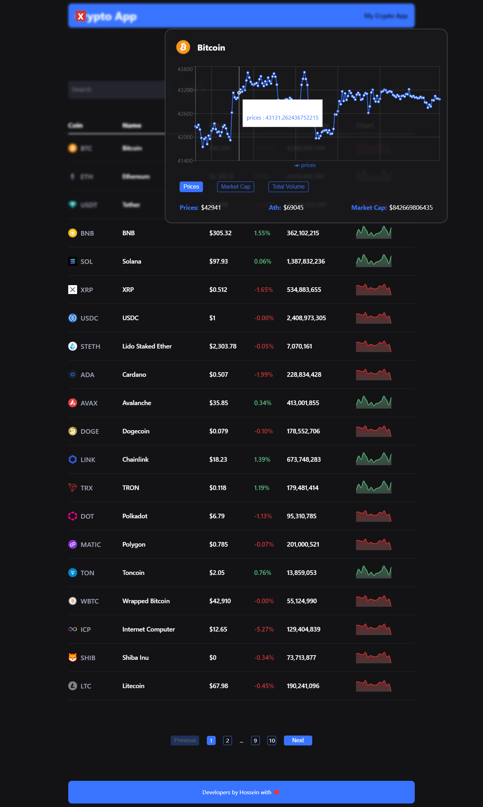

# React + Vite

# image crypto app

Project Title: CryptoToken Explorer

# Description:

Dive into the world of cryptocurrencies with my React-based project, the CryptoToken Explorer! This single-page application (SPA) is designed to provide users with a seamless experience to explore and visualize information about various cryptocurrencies.

# Key Features:

Search Functionality: Utilizing React and Paginate, the project allows users to search for specific cryptocurrency tokens by name. The search functionality is dynamic, providing real-time results as users type.

Pagination: Implemented Paginate for efficient handling of large datasets, ensuring a smooth and organized presentation of token information.

Interactive Medal Charts: Clicking on each token reveals an interactive medal chart showcasing its historical performance. I've integrated charting libraries to visualize the price trends, empowering users with valuable insights.

Responsive Design: The application is built with a responsive design, making it accessible and user-friendly across various devices, from desktops to mobile phones.

Efficient Routing: Leveraged React Router to seamlessly navigate between different sections of the application, providing a fluid and intuitive user experience.

Token Details: Each token page provides comprehensive details about the selected cryptocurrency, including historical price data, market cap, and relevant statistics.

API Integration: The project fetches real-time data from cryptocurrency APIs, ensuring that the information is up-to-date and accurate.

Technologies Used:

React.js
Paginate for React
React Router
Charting libraries for medal charts
Responsive design principles
How to Run:

Clone the repository from [GitHub Repo Link].
Navigate to the project directory.
Run npm install to install dependencies.
Run npm start to start the development server.
Open the application in your browser at http://localhost:3000.
Note:

This project is intended for educational purposes and aims to provide users with a visual exploration of cryptocurrency tokens. Ensure that you have a reliable internet connection for real-time data fetching.

Feel free to explore the code, make enhancements, and use it as a foundation for further development in the exciting field of cryptocurrency applications.

Happy exploring!

Currently, two official plugins are available:

- [@vitejs/plugin-react](https://github.com/vitejs/vite-plugin-react/blob/main/packages/plugin-react/README.md) uses [Babel](https://babeljs.io/) for Fast Refresh
- [@vitejs/plugin-react-swc](https://github.com/vitejs/vite-plugin-react-swc) uses [SWC](https://swc.rs/) for Fast Refresh
